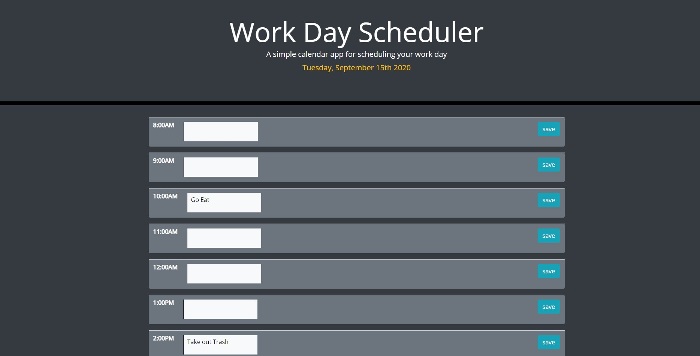

# Day Planner

## What Is It?
### This application shows standard work hours for a given day. In each hour, there is a slot to write a to-do. When the save button is clicked, that input is saved to local storage to said time and it will display even when the application is reloaded. Another feature is that it not only displays the current day of the week and month at the top of the screen, but there is a color change for what hour. The hour block is displayed green if it is currently that hour. It displays gray if it is past those hours. Lastly, it will display blue if those hours are coming up in the future. 

## How it works
### I first started with writing code that would work for the very first time block I have. I wanted to make sure that this was created within the JavaScript with jQuery. I first created a table and had the time become the row header in each row of the table. I appended the time to that row header, then appended the row header to the table. I then followed the same steps but once for an input field and once for a save button. Each time I made sure to append from the smallest element to the largest. Lastly, I appended all of that to the container that was created for the document. In order for the written tasks to be saved, I created an on-click listener for the save buttons. This saves the input into the local storage and will consistently display in the text area depending on the time that it was saved to. The color of the hour is based on an array that I created to match the time that might be displayed based on the for loop that was created. 

## Struggles
### The biggest struggles that I had was trying to create a better text area for the saved inputs. It initially was too small and way off to the side. I needed to read through the bootstrap documentation to better get an idea of how to display that better. 

## The Application

